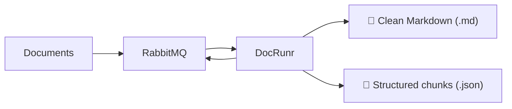

<p align="center">
  
  
</p>

<h1 align="center">DocRunr</h1>
<h3 align="center">Document to clean Markdown and chunks. That's it.</h3>

<p align="center">
  <a href="./LICENSE"></a>
  <a href="https://github.com/docrunr/docrunr/issues"></a>
  
  
</p>

<p align="center">
  
</p>

DocRunr gives you two ways to run document processing: a CLI for local and batch work, and a Docker container with a UI for your RAG stack development and production deployments.

### ✨ **Highlights**

- Binary file detection.
- Clean Markdown and stable chunk JSON output.
- Automatic parser fallback when extraction quality is weak.
- Worker setup with queue processing, uploads, health, stats, and artifact inspection.
- UI for uploads, jobs, and output review.

### 🎯 **Simple by design**

DocRunr does one job: it turns messy documents into clean Markdown and structured chunks. PDFs, Office files, email, HTML, images with text.

DocRunr is built for general purpose document handling, not for every possible document edge case. The goal is to make the common 80% of real world documents usable with a predictable pipeline, not to promise perfect conversion for every domain specific layout, template, or special use case. There will always be documents and use cases that need custom handling outside DocRunr.

Chunks are simple by design. We lean on the structure already in the document and use one chunking approach only: recursive, structure-based splitting with no overlap. Headings come first, paragraphs come next, and sentence boundaries are only used when needed. No strategy matrix, no tuning exercise, no guessing which splitter to use. The behavior is stable, documented in [`SPEC.md`](./SPEC.md), and easy to rely on in production. DocRunr solves this one part of your stack so you can stop thinking about document extraction and chunking and move on to the rest.

### 🔄 **How it works**

DocRunr fits into one small part of your stack. Locally, you can run the CLI on files directly. In Docker or production, you push jobs to RabbitMQ and let the DocRunr worker do the extraction and chunking.



The bundled UI sits on top of that same flow. It gives you an easy way to upload documents, inspect jobs, and review artifacts without building your own operator tooling first.

### 🐳 **Docker**

The Docker setup is: RabbitMQ, DocRunr, and local storage under `./.data`:

```bash
docker compose up -d --build
```

Open **http://localhost:8080** for the dashboard. From there you can upload documents, inspect jobs, and view artifacts. The worker also exposes `/health`, `/stats`, and `/api/*` on the same port.

**Object storage:** You can also use MinIO and switch the worker to S3-compatible storage.

<details>
<summary>Queue payloads</summary>

Job (`docrunr.jobs`): `job_id`, `source_path` required; optional `filename`, `options`, `priority` (0–255). Declare the queue with priority (e.g. `x-max-priority: 255`) and set AMQP `priority` to match.

Result (`docrunr.results`): `status` `ok` or `error`; `markdown_path` / `chunks_path` or `error`; echoes `priority`.

```json
{
  "job_id": "…",
  "filename": "report.pdf",
  "source_path": "input/…/….pdf",
  "options": {},
  "priority": 0
}
```

```json
{
  "job_id": "…",
  "status": "ok",
  "markdown_path": "output/…/….md",
  "chunks_path": "output/…/….json",
  "total_tokens": 0,
  "chunk_count": 0,
  "duration_seconds": 0,
  "error": null,
  "priority": 0
}
```

</details>

<details>
<summary>Environment variables</summary>

| Variable              | Default      | Notes                                     |
| --------------------- | ------------ | ----------------------------------------- |
| `RABBITMQ_*`          | see `.env`   | Host, port, user, password, queue names   |
| `STORAGE_TYPE`        | `local`      | `minio` for S3-compatible                 |
| `STORAGE_BASE_PATH`   | `/data`      | Local root                                |
| `MINIO_*`             | (see `.env`) | When `STORAGE_TYPE=minio`                 |
| `JOB_TIMEOUT_SECONDS` | `120`        | Per job                                   |
| `WORKER_CONCURRENCY`  | `1`          | Prefetch and in-process parallelism       |
| `HEALTH_PORT`         | `8080`       | HTTP + healthcheck                        |
| `SQLITE_BASE_PATH`    | `/db`        | Job history DB per replica                |
| `UI_PASSWORD`         | (empty)      | Optional session login for sensitive APIs |

</details>

### 🛠 **Tech stack**

- **Core runtime:** Python
- **Queue:** RabbitMQ
- **UI:** React, Vite, Mantine
- **Storage:** local disk or MinIO
- **Packaging:** Docker

### 💻 **Development**

To work on DocRunr locally, you need Python 3.11+, [`uv`](https://github.com/astral-sh/uv), Node.js 20+ with `corepack` for `pnpm`, and Docker for the local stack and integration tests.

```bash
git clone https://github.com/docrunr/docrunr.git
cd docrunr
cp .env.example .env
uv sync
pnpm -C ui install
```

**Workspace layout**

```
docrunr/
├── core/           # docrunr on PyPI (CLI + library)
├── worker/         # docrunr-worker (RabbitMQ, HTTP, bundled UI assets)
├── ui/             # React + Mantine; Vite in dev, static bundle in the image
├── tests/          # core, worker, integration, samples
└── scripts/        # release and dev helpers
```

#### Commands

After the clone and `.env` copy above, the commands below install dependencies and run DocRunr Worker in dev mode. For Docker, tests, lint, release, and other workflows, use the tasks in [`.vscode/tasks.json`](./.vscode/tasks.json).

| Command                  | Description                                        |
| ------------------------ | -------------------------------------------------- |
| `uv sync`                | Install the Python workspace and dev dependencies. |
| `pnpm -C ui install`     | Install UI dependencies.                           |
| `node ./scripts/dev.mjs` | Start dev                                          |

### ⌨️ **CLI**

The `docrunr` command processes a single file or walks a directory of supported documents and writes cleaned Markdown (`.md`) and chunk metadata (`.json`) next to each input unless you set `--out`. It uses the same pipeline as `convert()` in Python—no config files, same predictable output for the same input. The options table covers output location, verbose extraction logs, batch summary JSON, parallel workers, and filename filters. Full behavior, exit codes, and JSON shapes are documented in [`SPEC.md`](./SPEC.md).

Install from PyPI:

```bash
uv pip install docrunr
```

```bash
docrunr document.pdf
docrunr ./documents/ --out ./output -v -r
```

```python
from docrunr import convert

result = convert("report.pdf")
result.markdown
result.chunks
```

| Option      | Short | Description                              |
| ----------- | ----- | ---------------------------------------- |
| `--out`     | `-o`  | Output directory (default: beside input) |
| `--verbose` | `-v`  | Extraction details and timing            |
| `--report`  | `-r`  | Batch report JSON                        |
| `--workers` | `-w`  | Parallel workers for batch (`0` = auto)  |
| `--include` | `-i`  | Filter by name, extension, or glob       |

### 📋 **Supported formats**

DocRunr picks a parser from the file’s **detected MIME type** (binary based, via [Magika](https://github.com/google/magika)), not from the filename alone. Today the built-in registry handles the MIME types listed below, which correspond to the extensions in the table.

| Category      | Formats                       |
| ------------- | ----------------------------- |
| Documents     | PDF, DOCX, DOC, ODT           |
| Spreadsheets  | XLSX, XLS, ODS, CSV           |
| Presentations | PPTX, PPT, ODP                |
| Email         | EML, MSG                      |
| Web & markup  | HTML, HTM, XML, MD, JSON, TXT |
| Images        | JPG, JPEG, PNG, TIFF, BMP     |

### 📄 **License**

DocRunr is licensed under the **Apache License 2.0**.
