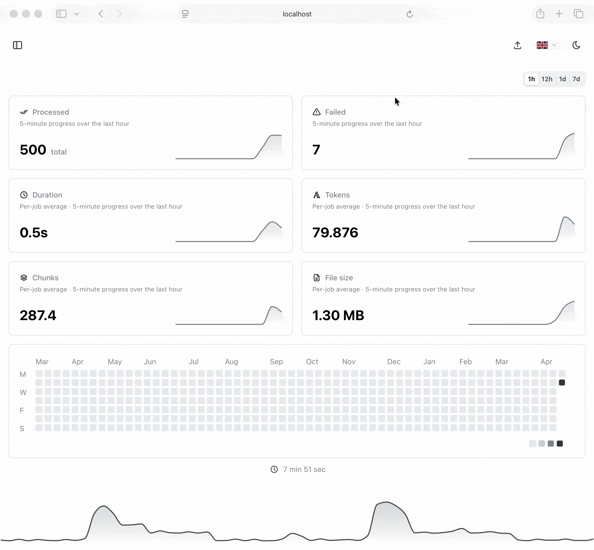
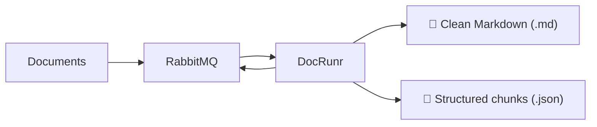

<p align="center">
  
  
</p>

<h3 align="center">Document to clean Markdown and chunks. That's it.</h3>

<p align="center">
  <a href="./LICENSE"></a>
  <a href="https://github.com/docrunr/docrunr/issues"></a>
  
  
</p>

<p align="center">
  
</p>

DocRunr supports a CLI for local and batch work, queue workers with an operator UI, and a local HTTP API for application integrations.

### ✨ **Highlights**

- Binary file detection.
- Clean Markdown and stable chunk JSON output.
- Automatic parser fallback when extraction quality is weak.
- Worker setup with queue processing, uploads, health, stats, and artifact inspection.
- UI for uploads, jobs, and output review.

### 🎯 **Simple by design**

DocRunr does one job: it turns messy documents into clean Markdown and structured chunks. PDFs, Office files, email, HTML, images with text.

DocRunr is built for general document handling, not for every possible document edge case. The goal is to make the common 80% of real world documents usable with a predictable pipeline, not to promise perfect conversion for every domain specific layout, template, or special use case. There will always be documents and use cases that need custom handling outside DocRunr.

Chunks are simple by design. We lean on the structure already in the document and use one chunking approach only: **recursive, structure based splitting with no overlap**. No strategy matrix, no tuning exercise, no guessing which splitter to use. The behavior is stable, documented in [`SPEC.md`](./SPEC.md), and easy to rely on.

### 🔄 **How it works**

DocRunr fits into one small part of your stack. Locally, you can run the CLI on files directly. In Docker or production, you push jobs to RabbitMQ and let the DocRunr worker do the extraction and chunking.


```mermaid
flowchart LR
    A[Documents] --> B[RabbitMQ]
    B --> C[DocRunr]
    C --> B
    C --> D["📝 Clean Markdown (.md)"]
    C --> E["🧩 Structured chunks (.json)"]
```

The bundled UI sits on top of that same flow. It gives you an easy way to upload documents, inspect jobs, and review artifacts without building your own operator tooling first.

### 🐳 **Docker**

The default Docker stack is RabbitMQ, the public API, the TXT worker, the LLM worker (LiteLLM + in-Docker Ollama), and local storage under `./.data`:

```bash
docker compose up -d --build
```

- Open http://localhost:8080 for the text extraction (TXT) dashboard.
- Open http://localhost:8081 for the LLM dashboard.
- Open http://localhost:8082 for the public API Swagger interface.

Upload and poll entirely over HTTP:

```bash
job_id="$(
  curl -sS -F file=@document.pdf http://127.0.0.1:8082/api/v1/documents |
    python -c 'import json,sys; print(json.load(sys.stdin)["data"]["job_id"])'
)"
curl -sS "http://127.0.0.1:8082/api/v1/jobs/${job_id}"
curl -sS "http://127.0.0.1:8082/api/v1/jobs/${job_id}/result?format=markdown"
```

Set `API_KEY` to require `Authorization: Bearer <key>`. Without a key, Compose publishes the API only on `127.0.0.1`. The local API deliberately has no cloud workspaces, roles, billing, or quotas. It owns the `docrunr.results` and `docrunr.llm.results` consumers and supports one SQLite-backed API replica.

**Object storage:** Use the SeaweedFS overlay so both workers use S3-compatible storage (list it last so it overrides `STORAGE_TYPE`):

```bash
docker compose -f docker-compose.base.yml -f docker-compose.llm.yml -f docker-compose.api.yml -f docker-compose.ollama.yml -f docker-compose.seaweedfs.yml up -d --build
```

**LLM embeddings:** Pass `llm_profile` on extraction jobs to trigger a follow-up embedding step. See [`SPEC.md`](./SPEC.md) (section 20) for the full protocol.

<details>
<summary>Queue payloads</summary>

**Extraction** — job and result fields, priority queues, and `llm_profile`: [`SPEC.md`](./SPEC.md), section 19.

```json
{
  "job_id": "…",
  "filename": "report.pdf",
  "source_path": "input/…/….pdf",
  "options": {},
  "priority": 0,
  "llm_profile": "nomic-embed-text-137m"
}
```

```json
{
  "job_id": "…",
  "status": "ok",
  "filename": "report.pdf",
  "source_path": "input/…/….pdf",
  "markdown_path": "output/…/….md",
  "chunks_path": "output/…/….json",
  "total_tokens": 0,
  "total_chars": 0,
  "chunk_count": 0,
  "duration_seconds": 0,
  "error": null,
  "priority": 0,
  "llm_profile": "nomic-embed-text-137m"
}
```

**LLM** (optional `worker-llm`) — queues, job and result fields, and retries: [`SPEC.md`](./SPEC.md), section 20.

```json
{
  "job_id": "new-uuid",
  "extract_job_id": "original-extraction-uuid",
  "filename": "report.pdf",
  "source_path": "input/2026/04/15/00/original-uuid.pdf",
  "chunks_path": "output/2026/04/15/00/original-uuid.json",
  "llm_profile": "nomic-embed-text-137m",
  "priority": 0,
  "metadata": {}
}
```

LLM result (`docrunr.llm.results`): `status` `ok` or `error`; on success, `artifact_path` points at the embeddings JSON; `provider`, `chunk_count`, `vector_count`, and `duration_seconds` describe the run.

```json
{
  "job_id": "new-uuid",
  "extract_job_id": "original-extraction-uuid",
  "status": "ok",
  "filename": "report.pdf",
  "source_path": "input/…/….pdf",
  "chunks_path": "output/…/….json",
  "llm_profile": "nomic-embed-text-137m",
  "provider": "ollama",
  "chunk_count": 12,
  "vector_count": 12,
  "duration_seconds": 3.41,
  "artifact_path": "output/…/….embeddings.json",
  "error": null
}
```

</details>

**Environment variables:** Text extraction and LLM workers are configured only via env vars; tables and defaults are in [`SPEC.md`](./SPEC.md) (section 22, _Configuration_, and section 20 for the LLM worker).

### 🛠 **Tech stack**

- **Core runtime:** Python
- **Queue:** RabbitMQ
- **UI:** React, Vite, Mantine
- **Storage:** local disk or S3-compatible object storage
- **Packaging:** Docker

### 💻 **Development**

To work on DocRunr locally, you need Python 3.11+, [`uv`](https://github.com/astral-sh/uv), Node.js 20+ with `corepack` for `pnpm`, and Docker for the local stack and integration tests.

```bash
git clone https://github.com/docrunr/docrunr.git
cd docrunr
cp .env.example .env
uv sync
pnpm -C ui install
```

**Workspace layout**

```
docrunr/
├── core/           # docrunr on PyPI (CLI + library)
├── runtime/        # lightweight shared storage and messaging primitives
├── api/            # docrunr-api public HTTP gateway
├── worker/         # docrunr-worker (RabbitMQ, HTTP, bundled UI assets)
├── worker-llm/     # docrunr-worker-llm (optional LLM post-processing)
├── ui/             # React + Mantine; Vite in dev, static bundle in the image
├── tests/          # core, runtime, API, workers, integration, samples
└── scripts/        # release and dev helpers
```

#### Commands

After the clone and `.env` copy above, the commands below install dependencies and run DocRunr Worker in dev mode. For Docker, tests, lint, release, and other workflows, use the tasks in [`.vscode/tasks.json`](./.vscode/tasks.json).

| Command                        | Description                                        |
| ------------------------------ | -------------------------------------------------- |
| `uv sync`                      | Install the Python workspace and dev dependencies. |
| `pnpm -C ui install`           | Install UI dependencies.                           |
| `node ./scripts/dev.mjs`       | Start dev                                          |
| `node ./scripts/dev.mjs --llm` | Start dev with LLM worker + LiteLLM                |

### ⌨️ **CLI**

The `docrunr` command processes a single file or walks a directory of supported documents and writes cleaned Markdown (`.md`) and chunk metadata (`.json`) next to each input unless you set `--out`. It uses the same pipeline as `convert()` in Python—no config files, same predictable output for the same input. The options table covers output location, verbose extraction logs, batch summary JSON, parallel workers, and filename filters. Full behavior, exit codes, and JSON shapes are documented in [`SPEC.md`](./SPEC.md).

Install from PyPI:

```bash
uv pip install docrunr
```

```bash
docrunr document.pdf
docrunr ./documents/ --out ./output -v -r
```

```python
from docrunr import convert

result = convert("report.pdf")
result.markdown
result.chunks
```

| Option      | Short | Description                              |
| ----------- | ----- | ---------------------------------------- |
| `--out`     | `-o`  | Output directory (default: beside input) |
| `--verbose` | `-v`  | Extraction details and timing            |
| `--report`  | `-r`  | Batch report JSON                        |
| `--workers` | `-w`  | Parallel workers for batch (`0` = auto)  |
| `--include` | `-i`  | Filter by name, extension, or glob       |

### 📋 **Supported formats**

DocRunr picks a parser from the file’s **detected MIME type** (binary based, via [Magika](https://github.com/google/magika)), not from the filename alone. Today the built-in registry handles the MIME types listed below, which correspond to the extensions in the table.

| Category      | Formats                       |
| ------------- | ----------------------------- |
| Documents     | PDF, DOCX, DOC, ODT           |
| Spreadsheets  | XLSX, XLS, ODS, CSV           |
| Presentations | PPTX, PPT, ODP                |
| Email         | EML, MSG                      |
| Web & markup  | HTML, HTM, XML, MD, JSON, TXT |
| Images        | JPG, JPEG, PNG, TIFF, BMP     |

### 📄 **License**

DocRunr is licensed under the **Apache License 2.0**.
